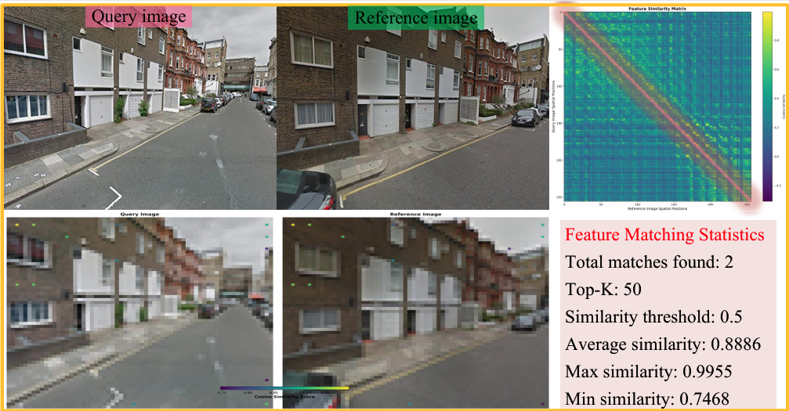

# A²GC: Asymmetric Aggregation with Geometric Constraints for Locally Aggregated Descriptors

A PyTorch implementation of A²GC (Asymmetric Aggregation with Geometric Constraints) for Visual Place Recognition (VPR), featuring support for DINOv2 backbones.

## 🚀 Features

- **Multiple Backbone Support**: DINOv2 (ViT-B/14, ViT-L/14, ViT-G/14), and ResNet
- **Asymmetric Aggregation with Geometric Constraints**: A²GC aggregator for robust feature aggregation
- **Comprehensive Evaluation**: Support for multiple VPR benchmarks (Pittsburgh, MSLS, Nordland, SPED, SF-XL)
- **Flexible Training**: PyTorch Lightning-based training with various loss functions and optimizers
- **Visualization Tools**: Feature matching and heatmap visualization utilities

## 📋 Table of Contents

- [Installation](#installation)
- [Quick Start](#quick-start)
- [Dataset](#dataset)
- [Training](#training)
- [Results](#results)
- [Visualization](#visualization)

## 🔧 Installation

### Prerequisites

- Python 3.8+
- CUDA-capable GPU (recommended)
- PyTorch 1.12+

### Setup

1. Clone the repository:
```bash
git clone https://github.com/CV4RA/A2GC.git
cd A2GC
```

2. Create a conda environment:
```bash
conda env create -f environment.yml
conda activate A2GC
```

3. Install additional dependencies:
```bash
pip install pytorch-lightning faiss-cpu  # or faiss-gpu for GPU support
```

## 🚀 Quick Start

### Evaluation with Pre-trained Model

```bash
python eval.py \
    --ckpt_path weights/your_best.ckpt \
    --backbone_arch dinov2_vitb14 \
    --val_datasets pitts30k_test msls_val \
    --faiss_gpu
```

### Training

```bash
python main.py
```

Modify `main.py` to customize training parameters, backbone architecture, and aggregator configuration.

## 📦 Dataset

### Supported Datasets

- **Pittsburgh 30k/250k**: Download from [VPR-Bench](https://github.com/MubarizZaffar/VPR-Bench)
- **MSLS (Mapillary Street Level Sequences)**: Download from [MSLS website](https://www.mapillary.com/datasets/places)
- **Nordland**: Download from [Nordland dataset](https://surfdrive.surf.nl/files/index.php/s/sbZRXzYe3l0v67W)
- **SPED**: Download from [SPED dataset](https://github.com/ahmetozlu/vehicle_counting_tensorflow)
- **SF-XL**: Download from [SF-XL dataset](https://github.com/gmberton/CosPlace)

### Dataset Structure

```
data/
├── Pittsburgh/
│   ├── queries_real/
│   └── [000-010]/
├── mapillary/
│   ├── train_val/
│   └── test/
├── Nordland/
│   ├── query/
│   └── ref/
└── ...

datasets/
├── Pittsburgh/
│   ├── pitts30k_test_dbImages.npy
│   ├── pitts30k_test_qImages.npy
│   └── pitts30k_test_gt.npy
└── ...
```

## 🏋️ Training

### Configuration

Edit `main.py` to configure:

- **Backbone**: `backbone_arch` (e.g., `'dinov2_vitb14'`)
- **Aggregator**: `agg_arch` (e.g., `'ASYOT'` for A²GC)
- **Training parameters**: learning rate, batch size, optimizer, etc.

### Training on GSV-Cities

The default training uses GSV-Cities dataset. Ensure the dataset is properly set up in `data/GSVCities/`.

## 📈 Results

### Performance on Standard Benchmarks

| Method | Pitts30k (R@1/5/10) | Pitts250k-test (R@1/5/10) | MSLS-val (R@1/5/10) | MSLS-challenge (R@1/5/10) |
|--------|---------------------|---------------------------|---------------------|---------------------------|
| NetVLAD (CVPR 2016) | 81.9/91.2/93.7 | 90.5/96.2/97.4 | 53.1/66.5/71.1 | 35.1/47.4/51.7 |
| CosPlace (CVPR 2022) | 88.5/94.5/95.2 | 92.4/97.2/98.1 | 82.8/89.7/92.0 | 61.4/72.0/76.6 |
| MixVPR (WACV 2023) | 91.5/95.5/96.3 | 94.6/98.3/99.0 | 88.2/93.1/94.3 | 64.0/75.9/80.6 |
| R²Former (CVPR 2023) | 91.1/95.2/96.3 | 93.2/97.5/98.3 | 89.7/95.0/96.2 | 73.0/85.9/88.8 |
| EigenPlaces (ICCV 2023) | 92.5/96.8/97.6 | 94.1/98.0/98.7 | 89.1/93.8/95.0 | 67.4/77.1/81.7 |
| SelaVPR (ICLR 2024) | 92.8/96.8/97.7 | 95.7/98.8/99.2 | 90.8/96.4/97.2 | 73.5/87.5/90.6 |
| CricaVPR (CVPR 2024) | 94.9/97.3/98.2 | 95.6/98.9/99.5 | 90.0/95.4/96.4 | 69.0/82.1/85.7 |
| SALAD (CVPR 2024) | 92.4/96.3/97.4 | 95.1/98.5/99.1 | 92.2/96.2/97.0 | 75.0/88.8/91.3 |
| FoL (AAAI 2025) | 94.5/97.4/98.2 | 97.0/99.2/99.5 | 93.5/96.9/97.6 | 80.0/90.9/93.0 |
| Pair-VPR (RAL 2025) | 95.4/97.5/98.0 | — | 95.4/97.3/97.7 | 81.7/90.2/91.3 |
| **A²GC (Ours)** | **95.6/99.3/99.8** | **97.3/99.3/99.7** | **93.6/97.5/97.9** | **80.6/90.9/92.5** |

### Impact of Input Resolution

| Input Size | Pitts30k (R@1/5/10) | MSLS-val (R@1/5/10) |
|------------|---------------------|---------------------|
| 224×224 | 94.9/98.5/99.5 | 90.4/95.3/96.1 |
| 364×364 | 94.9/99.1/99.6 | 91.0/96.0/96.6 |
| 406×406 | 95.2/99.2/99.8 | 93.2/96.7/97.2 |
| 588×588 | **96.7/99.8/100** | **96.4/97.9/98.6** |

## 🎨 Visualization

### Feature Matching Visualization

Visualize feature matches between query and reference images:

```bash
python tools/visualize_feature_matching.py \
    --query path/to/query.jpg \
    --ref path/to/reference.jpg \
    --ckpt weights/a2gc.ckpt \
    --backbone dinov2_vitb14 \
    --top-k 200 \
    --threshold 0.3 \
    --out ./viz_matching
```

This generates:
- `feature_matching_lines.png`: Matching points with color-coded similarity scores
- `similarity_matrix.png`: Full similarity matrix visualization
- `feature_heatmap_comparison.png`: Feature activation heatmaps

### Visualization

```bash
python tools/visualize_feature_maps.py \
    --image path/to/image.jpg \
    --ckpt weights/a2gc.ckpt \
    --backbone dinov2_vitb14 \
    --out ./viz_features
```




## 🏗️ Architecture

### Model Components

1. **Backbone**: Feature extraction (DINOv2/ResNet)
2. **Aggregator**: Feature aggregation (ASYOT for A²GC)
3. **Loss Function**: Metric learning loss (MultiSimilarityLoss)

### A²GC Aggregator

The Asymmetric Aggregation with Geometric Constraints (A²GC) aggregator uses asymmetric optimal transport with geometric constraints to aggregate spatial features, providing robust place descriptors that are invariant to viewpoint changes and partial occlusions.

## 🙏 Acknowledgments

- [DINOv2](https://github.com/facebookresearch/dinov2) for the vision transformer backbone
- [CosPlace](https://github.com/gmberton/CosPlace) for dataset preparation utilities
- [PyTorch Lightning](https://www.pytorchlightning.ai/) for the training framework
- [salad](https://github.com/serizba/salad) for the code support.


